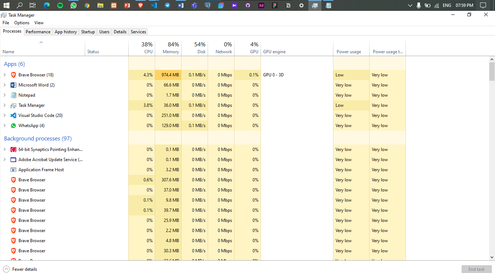
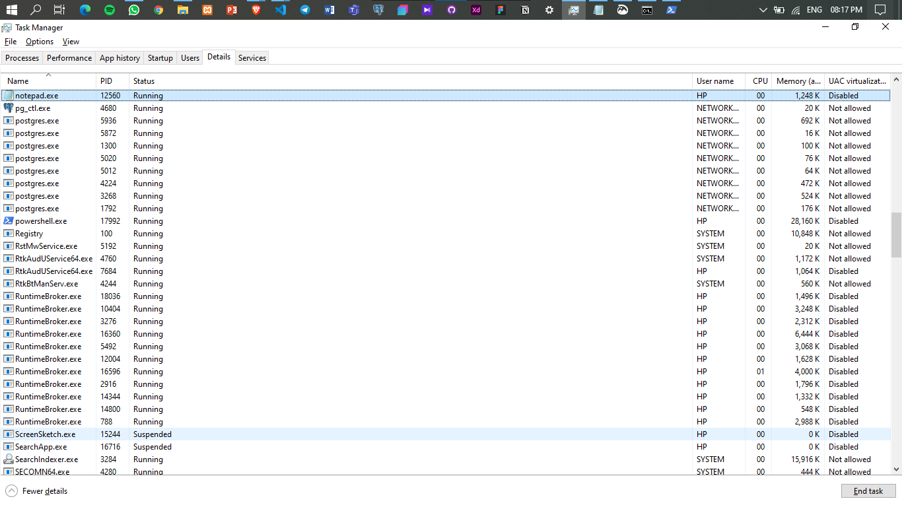
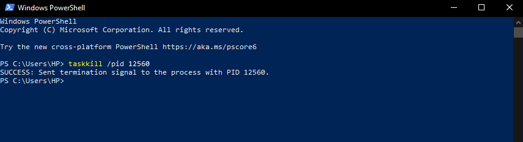
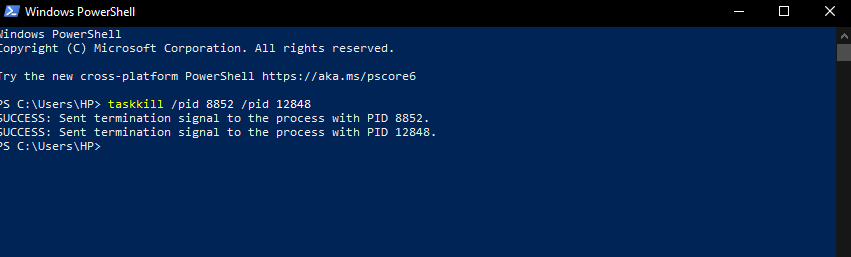

# Maintain Efficient Process Utilization on Windows

**Collect process information using the Task Viewer.**



**Terminate a specific process using Windows PowerShell.**

First find the pid of the process you want to kill. Go to Task manager and click the details to find PID

PID - Process ID



Then open windows power shell and type the following command

```windows power shell command 
taskkill /pid [your pid]
```


**Terminate multiple processes using Windows PowerShe**

To kill multiple task, type the following command in the windows power shell


```windows power shell command 
taskkill /pid [your pid]  /pid [your pid]
```


If the you run the command, the task which is running in the computer gets terminated.