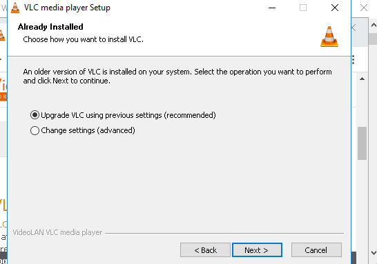
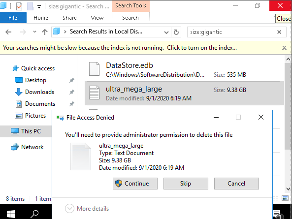
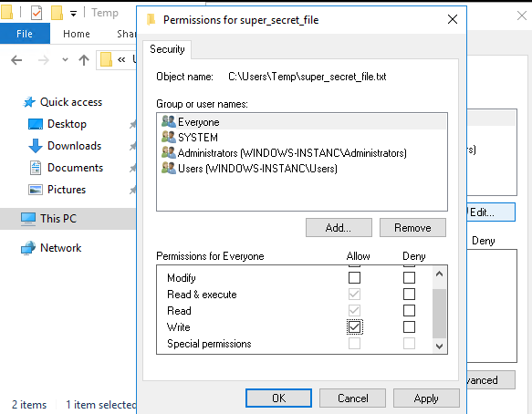
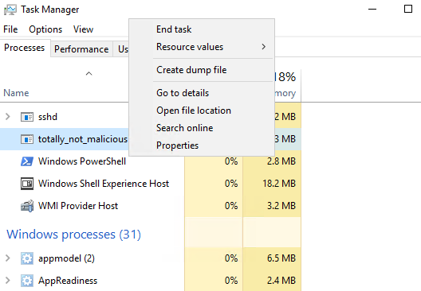

# Using Logs to Help You Track Down an Issue in Windows

**Updating software that's out-of-date**

Update VLC, download installer: https://www.videolan.org/vlc/download-windows.html install and choose update

**Finding and deleting files**

Delete ultra_mega_large (9.38 GB) file, use search feature

**Modifying file permissions**

Fix Permissions , go to C:\Users\Temp, open super_secret_file's properties, check write's box permission

**Finding and terminating specific processes**

End malicious processes, go to task manager, search for "totaly_not_malicious", end task

